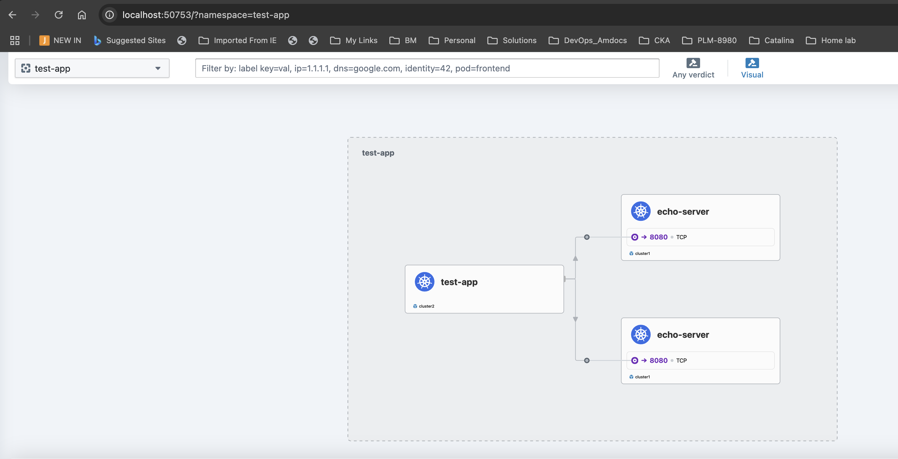

# Infra Repository

Infrastructure as Code for Kubernetes cluster and application management using Ansible.

## Structure
- `ansible/`: Playbooks and inventory for cluster setup.
- `manifests/`: Kubernetes manifests for deploying applications.
- `cluster-setup.txt`: Manual steps to provision a 3-node cluster with Cilium CNI.
- `test-mesh.txt`: Steps to test the cluster mesh setup.

## Prerequisites
1. Install [Multipass](https://multipass.run/).
2. Install [Ansible](https://docs.ansible.com/ansible/latest/installation_guide/intro_installation.html).

## Configuration
1. Create an `ansible.cfg` file in the `ansible/` directory with the following content:
   ```ini
   [defaults]
   inventory = ./inventory/inventory.ini
   host_key_checking = False
   roles_path = ./roles
   ```

2. Create an `inventory.ini` file in the `ansible/` directory with the following content:
   ```ini
   [localhost]
   localhost ansible_connection=local
   ```

3. Define your clusters and mesh configuration in the `clusters.yml` file located in the `ansible/env/` directory:
   ```yaml
   clusters:
     - name: cluster1
       id: 01
       kubernetes_version: "1.32"
       pod_network_cidr: "10.218.0.0/16"
       nodes:
         - name: "cluster1-k8s-master"
           cpus: 2
           memory: 2G
           disk: 10G
         - name: "cluster1-k8s-worker-1"
           cpus: 2
           memory: 4G
           disk: 10G
         - name: "cluster1-k8s-worker-2"
           cpus: 2
           memory: 4G
           disk: 10G
     - name: cluster2
       id: 02
       kubernetes_version: "1.32"
       pod_network_cidr: "10.219.0.0/16"
       nodes:
         - name: "cluster2-k8s-master"
           cpus: 2
           memory: 2G
           disk: 10G
         - name: "cluster2-k8s-worker-1"
           cpus: 2
           memory: 4G
           disk: 10G
         - name: "cluster2-k8s-worker-2"
           cpus: 2
           memory: 4G
           disk: 10G
     # Add more clusters as needed

   clusterMesh:
     - meshName: mesh1
       clusters: 
         - cluster1
         - cluster2
     # Add more meshes as needed
   ```
## Hubble Image


## Usage

4. Run the Ansible playbook with the `ANSIBLE_HOST_KEY_CHECKING` environment variable from the `ansible` directory:
   ```sh
   cd ansible
   ANSIBLE_HOST_KEY_CHECKING=False ansible-playbook playbooks/cluster-setup.yml
   ```

## Playbook Overview
The playbook `cluster-setup.yml` performs the following tasks:

### Pre-tasks
- Fails if `cluster_name` is not defined.
- Cleans DHCP lease entries.
- Removes existing SSH known_hosts entries.

### Phase 1: VM Setup
- Launches VMs in parallel using Multipass.
- Waits for VMs to be in a running state.
- Sleeps for 30 seconds after VM launch.

### Phase 2: Network Setup
- Retrieves VM IPs.
- Updates the `/etc/hosts` file with the new host entries.

### Phase 3: SSH Setup
- Ensures the SSH key is set for the `ubuntu` user using Multipass.
- Waits for SSH to be available.
- Adds host keys to the known_hosts file.

### Phase 4: Package Installation
- Creates the keyrings directory.
- Adds the Kubernetes GPG key.
- Adds the Kubernetes repository.
- Installs necessary packages and Kubernetes tools.
- Sleeps for 30 seconds after package installation.

### Phase 5: Kubernetes Prerequisites
- Enables IP forwarding.
- Ensures the `br_netfilter` module is loaded.
- Ensures required sysctl parameters are set.
- Installs `containerd` and `runc`.
- Enables and starts the `kubelet` service.
- Configures `containerd` to use the systemd cgroup driver.
- Configures `kubelet` to use the systemd cgroup driver.
- Creates the `crictl` configuration file.

### Phase 6: Cluster Setup
- Initializes the Kubernetes master node.
- Sleeps for 30 seconds after `kubeadm init`.
- Sets up the kubeconfig for the master node.
- Copies the kubeconfig file from the master node to the local machine.
- Waits for the Kubernetes API server to be accessible.
- Installs a pod network add-on (Cilium) using Helm.
- Waits for the pod network to be ready.
- Retrieves the join command from the master node.
- Joins worker nodes to the cluster.
- Installs Hubble UI

### Phase 7: Cluster Mesh Setup
- Renames clusters, contexts, and users in kubeconfig.
- Sets the KUBECONFIG environment variable.
- Merges kubeconfig files.
- Enables cluster mesh on each cluster.
- Connects clusters using Cilium CLI.
- Waits for cluster mesh to be ready.

## Testing the Cluster Mesh

1. Deploy the echo server in `cluster1`:
   ```sh
   kubectl --kubeconfig ~/.kube/cluster1-cluster apply -f manifests/echo-server-cluster1.yaml
   ```

2. Deploy the test client in `cluster2`:
   ```sh
   kubectl --kubeconfig ~/.kube/cluster2-cluster apply -f manifests/test-client.yaml
   ```

3. Test the connection from the test client to the echo server:
   ```sh
   kubectl --kubeconfig ~/.kube/cluster2-cluster exec -it test-client -n test-app -- sh
   / # wget -qO- echo-server.test-app.svc.cluster.local
   ```

   You should see a response from the echo server indicating that the request was served by one of the echo server pods.

## Additional Files

- `cluster-setup.txt`: Manual steps to provision a 3-node cluster with Cilium CNI.
- `test-mesh.txt`: Steps to test the cluster mesh setup.

## Note
This playbook currently supports Mac OS only.